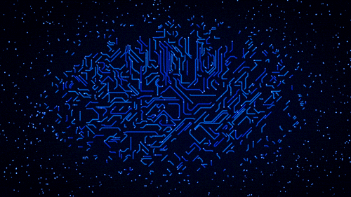

<a href="https://git.io/typing-svg"></a>

| 🔲 **RTL Design Engineer** | 🏢 **Design Verification Engineer** | 🛠️ **AI/ML Framework** | 🖥️ **IP/SoC Engineer** |


<!-- Animated GIF -->
<div align="center">
  
</div>

<!-- Modern Typing Animation -->
<div align="center">
  
</div>

<br/>

<!-- CV Download Badge -->
<div align="center">
  <a href="https://github.com/ducnguyen-git/CV/Nguyen_Minh_Duc_CV.pdf">
    
  </a>
  &emsp;
  <a href="mailto:ducnguyen.hcmwork@gmail.com">
    
  </a>
  &emsp;
  <a href="https://www.linkedin.com/in/ducnguyenhcmwork/">
    
  </a>
  &emsp;
  <a href="tel:+84 387801290">
    
  </a>
</div>

<br/>

---

## 🎯 **About Me**
```diff
+ 💡 Passionate about chip design environment
+ 🏢 Experienced in RTL, DV & IP/SoC design
! 🤖 Deep diving into AI/ML framework and development
# 📈 Enjoy acquiring new knowledge and solving scaling challenges
# 🔧 Hardware setup, technical debugging, network connecting & team working
```

## 🛠 **Tech Stack**

### **Programming Languages**


### **Tools**


### **Code Editor**


### **AI**


### **Virtual Machine**


### **Framework**


### **Education**


## 💼 **Experience**

### **Teaching Assistant**  (3/2025-12/2025)
```diff
# Teaching Assistant
+ Support new members at offline and online basic course classes. 
+ Provide practice lessons guidance to all the members.
+ Correct homework and resolve technical issues.
#   Verilog | SystemVerilog | Testbench | Specs
```

## 🏆 **Achievements & Certifications**

<p align="left">
  
</p>

```diff
+ 🏛️ Learning Scholarship at IU 2021-2022 & 2024-2025
+ 🏅 100% Scholarship Master's program from CT Group - 2026
```

## 📊 **GitHub Stats**

<div align="center">
  
  
  
</div>

<div align="center">
  
</div>

<br/>

<!-- GitHub Profile Summary Cards -->
<div align="center">
  
</div>

---

<!-- Waving Footer -->

